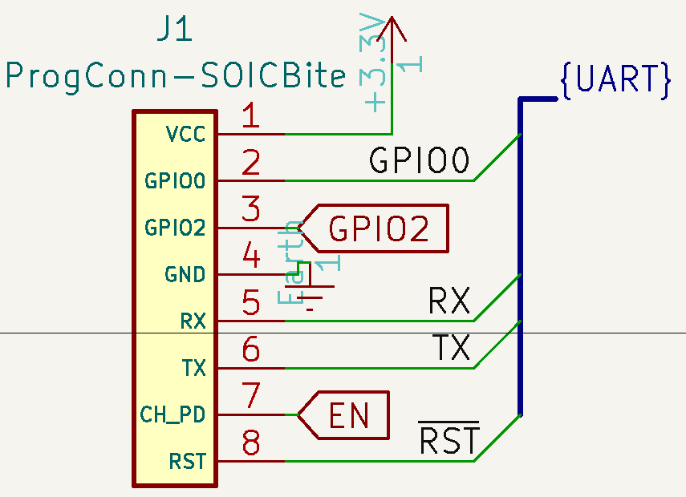
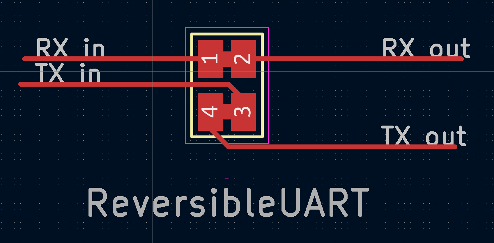
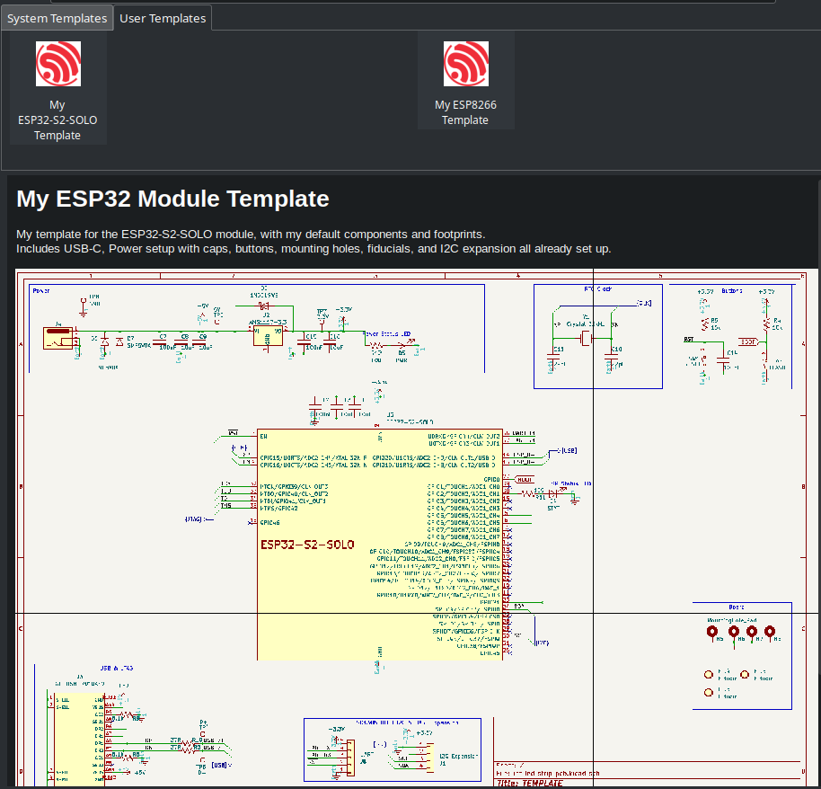

# jmux-kicad-things

A place for my kicad symbols, footprints, template files and other miscellanea.

This is best used with a clean Kicad installation. 

Some symbols/footprints in here are imported from easyeda using [easyeda2kicad](https://hackaday.com/2023/08/08/easyeda2kicad-never-draw-a-footprint-again/), others are drawn by me for specific components I commonly use, and others are of my own creation. 

I try to keep this repo clean from included libraries, but mistakes happen. If you notice something, please open an issue. 

A lot of my designs also incorporate things from the following libraries:
* [kicad-tag-connect](https://github.com/nawotech/kicad-tag-connect) by nawotech
* [SOICbite](https://github.com/SimonMerrett/SOICbite) by SimonMerrett
* The Espressif KiCad Library (installed via Kicad)

> [!NOTE]
> As of Feb 2024 the full functionality of the `setup-kicad-things.sh` script has not been tested from-scratch, since my environment is already configured. When I get the chance to test it, this warning will be removed. Until then, use with caution.

###### Setup
To set up templates, libraries, and other files, run `setup-kicad-things.sh`. This script sets up symlinks from `~/.local/share/kicad/7.0/` to the directories in this repo, and moves any existing files into subdirectories under `old_kicad_conf/`. These files can then be manually moved into their corresponding directories in the repo.

This makes setup easy, and prevents excessive modification of the kicad local configuration directory. To remove this repo, just delete the symlinks. 

### Repo Highlights
* SOICBite UART and JTAG connector symbols for custom boards
<p align="center">
<br>
Example of the SOICBite symbol in use, from my iot_pwm_leddriver project. 
</p>

* Reversible UART bridge, which lets you easily swap your TX/RX in case you mess it up on a prototype. 
    * To use, just include the symbol and footprint in your design and wire it up as shown. If there's an issue, cut the solderjumper bridge and solder 0805 0Ω resistors vertically. 
    * This is fine for UART, but for signals of higher frequencies you might run into issues because of impedance mismatch and the number of sharp edges present. 
<p align="center">
<br>
Layout example for the UART bridge
</p>

* Templates for the ESP8266 and ESP32-SOLO, set up with my default parts (most of which are from the JLCPCB Basic parts library)
<p align="center">
<br>
Template page and description for my ESP32-Solo template
</p>

* `Breadboard-Proto` symbol library, quick symbols for breadboard project protyping. 


### Contents
* `footprints` contains footprints for my commonly used components along with custom ones
* `my_schematics` - schematics I commonly use in my designs
* `symbols` - Schematic symbols
* `templates` - My templates for automatically setting up projects
* `setup-kicad-things.sh` - script to set up repo, see [#Setup](#Setup) above.

#### Structure

```
├── README.md
├── setup-kicad-things.sh
├── footprints
│   ├── jmux-footprints.pretty
│   └── packages3d
├── my_schematics
│   └── Power_and_board.kicad_sch
├── old_kicad_confs/
├── symbols
│   ├── Breadboard-Proto.kicad_sym
│   └── jmux-kicadlib.kicad_sym
└── templates
    ├── esp32-s2-solo-template
    └── esp8266-template
    
```


## Other
### easyeda2kicad shortcut from my .zshrc
In case anyone else finds it useful. Just provide the LCSC id and run it from the project folder, and as long as `./projectlib/` is created everything works nice and smooth. 
```sh
# easyeda2kicad shortcut just requiring the LCSC id, designed to be run from project folder
alias e2kicad="easyeda2kicad --output ./projectlib/projectlib --full --lcsc_id "
```


